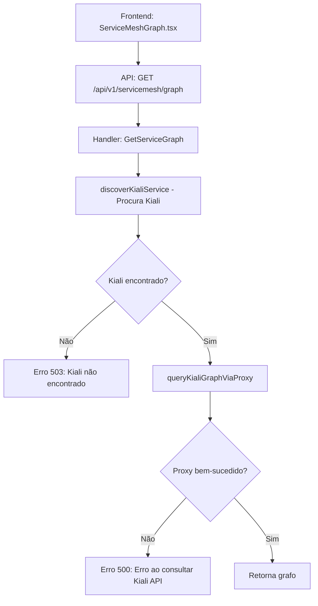

# 🔍 Diagnóstico: Erro Service Mesh - "Erro ao consultar Kiali API"

**Data**: 11 de dezembro de 2025
**Status**: 🔴 Erro identificado

---

## ❌ Erro Reportado

```
Erro ao carregar service mesh: Erro ao consultar Kiali API
```

---

## 🔍 Análise do Código

### Fluxo de Execução



### Código Relevante

**`internal/web/handlers/servicemesh.go:136-181`**

```go
func (h *ServiceMeshHandler) GetServiceGraph(c *gin.Context) {
    // 1. Descobre serviço Kiali no cluster
    kialiService, kialiNamespace, kialiPort, err := h.discoverKialiService(clientset)
    if err != nil {
        c.JSON(http.StatusServiceUnavailable, gin.H{
            "error": "Kiali não encontrado no cluster",  // ← Erro 503
            "details": err.Error(),
        })
        return
    }

    // 2. Consulta via proxy do Kubernetes
    graphData, err := h.queryKialiGraphViaProxy(clientset, ...)
    if err != nil {
        c.JSON(http.StatusInternalServerError, gin.H{
            "error": "Erro ao consultar Kiali API",  // ← Erro 500 (este é o erro reportado)
            "details": err.Error(),
        })
        return
    }
}
```

**Proxy Path Construído (`line 299`):**
```go
proxyPath := fmt.Sprintf("/api/v1/namespaces/%s/services/http:%s:%d/proxy/api/namespaces/%s/graph",
    serviceNamespace, serviceName, servicePort, namespace)
```

**Exemplo de URL:**
```
/api/v1/namespaces/istio-system/services/http:kiali:20001/proxy/api/namespaces/production/graph?duration=60s&graphType=workload
```

---

## 🐛 Possíveis Causas

### 1. **Kiali NÃO está instalado no cluster** ✅ MAIS PROVÁVEL

**Sintoma**: Erro 503 com mensagem "Kiali não encontrado no cluster"

**Verificação**:
```bash
# Verificar se Kiali está instalado
kubectl get pods -n istio-system | grep kiali
kubectl get svc -n istio-system | grep kiali
kubectl get svc -n kiali | grep kiali

# Saída esperada (se instalado):
# kiali-xxxx-yyyy   1/1   Running   0   2d
# kiali             ClusterIP   10.0.x.x   <none>   20001/TCP   2d
```

**Se NÃO retornar nada → Kiali não está instalado**

---

### 2. **Kiali está em namespace diferente** 🔶 POSSÍVEL

**Sintoma**: Código procura em `istio-system`, `kiali`, `kiali-operator`, mas Kiali está em outro namespace

**Verificação**:
```bash
# Procurar Kiali em TODOS os namespaces
kubectl get svc --all-namespaces | grep kiali

# Se encontrar em namespace diferente (ex: observability):
# observability   kiali   ClusterIP   10.0.x.x   20001/TCP
```

**Solução**: Adicionar namespace à lista de busca em `servicemesh.go:265`

---

### 3. **Porta do Kiali está diferente** 🔶 POSSÍVEL

**Sintoma**: Código usa porta padrão `20001`, mas Kiali está em outra porta

**Verificação**:
```bash
# Ver porta do serviço Kiali
kubectl get svc -n istio-system kiali -o jsonpath='{.spec.ports[0].port}'

# Saída esperada: 20001
# Se for diferente (ex: 8080), proxy vai falhar
```

---

### 4. **Proxy do Kubernetes não funciona** 🔶 MENOS PROVÁVEL

**Sintoma**: Service descoberto corretamente, mas proxy falha

**Motivos**:
- Kubeconfig sem permissão para criar proxies
- API Server não permite proxy para services
- Firewall/NetworkPolicy bloqueando tráfego

**Verificação manual**:
```bash
# Testar proxy via kubectl
kubectl proxy --port=8001 &

# Testar URL do proxy
curl http://localhost:8001/api/v1/namespaces/istio-system/services/http:kiali:20001/proxy/api/status

# Saída esperada (se funcionar):
# {
#   "status": {
#     "Kiali commit hash": "abc123...",
#     "Kiali version": "v1.79.0"
#   }
# }

# Se falhar → Proxy não funciona
```

---

### 5. **Kiali requer autenticação** 🔶 MENOS PROVÁVEL

**Sintoma**: Proxy conecta, mas Kiali retorna 401/403

**Verificação**:
```bash
# Verificar estratégia de auth do Kiali
kubectl get cm -n istio-system kiali -o yaml | grep auth

# Estratégias possíveis:
# - anonymous: Sem auth (padrão)
# - token: Requer Bearer token
# - openid: Requer OAuth
```

---

## 🔧 Plano de Diagnóstico

Execute os comandos abaixo **NA ORDEM** para identificar a causa:

### **Passo 1: Verificar se Istio está instalado**

```bash
kubectl get ns istio-system 2>/dev/null || echo "❌ Namespace istio-system NÃO EXISTE"
kubectl get pods -n istio-system 2>/dev/null || echo "❌ Istio NÃO está instalado"
```

**Se retornar "NÃO EXISTE" → Istio não está instalado, logo Kiali também não está.**

---

### **Passo 2: Verificar se Kiali está instalado**

```bash
# Procurar Kiali em namespaces comuns
echo "=== Procurando Kiali em istio-system ==="
kubectl get svc -n istio-system kiali 2>/dev/null && echo "✅ Encontrado" || echo "❌ Não encontrado"

echo "=== Procurando Kiali em namespace kiali ==="
kubectl get svc -n kiali kiali 2>/dev/null && echo "✅ Encontrado" || echo "❌ Não encontrado"

echo "=== Procurando Kiali em TODOS os namespaces ==="
kubectl get svc --all-namespaces | grep kiali || echo "❌ Kiali NÃO está instalado em nenhum namespace"
```

**Se NÃO retornar nada → Kiali precisa ser instalado.**

---

### **Passo 3: Verificar detalhes do serviço Kiali (se encontrado)**

```bash
# Substituir NAMESPACE pelo namespace correto (ex: istio-system)
NAMESPACE="istio-system"

echo "=== Detalhes do serviço Kiali ==="
kubectl get svc -n $NAMESPACE kiali -o yaml

echo "=== Porta do serviço ==="
kubectl get svc -n $NAMESPACE kiali -o jsonpath='{.spec.ports[0].port}'
echo ""

echo "=== Pods do Kiali ==="
kubectl get pods -n $NAMESPACE -l app=kiali
```

---

### **Passo 4: Testar proxy manualmente**

```bash
# Substituir valores corretos
NAMESPACE="istio-system"
SERVICE="kiali"
PORT="20001"
TARGET_NS="production"  # Namespace com Istio habilitado

# 1. Iniciar kubectl proxy
kubectl proxy --port=8001 &
PROXY_PID=$!

# 2. Testar health do Kiali
echo "=== Testando /api/status (health check) ==="
curl -s "http://localhost:8001/api/v1/namespaces/$NAMESPACE/services/http:$SERVICE:$PORT/proxy/api/status" | jq

# 3. Testar service graph
echo "=== Testando /api/namespaces/$TARGET_NS/graph ==="
curl -s "http://localhost:8001/api/v1/namespaces/$NAMESPACE/services/http:$SERVICE:$PORT/proxy/api/namespaces/$TARGET_NS/graph?duration=60s&graphType=workload" | jq

# 4. Matar proxy
kill $PROXY_PID
```

**Saída esperada**:
- **Status**: JSON com informações do Kiali (versão, commit hash)
- **Graph**: JSON com nodes e edges (pode estar vazio se namespace não tem tráfego)

**Se falhar**:
- `404 Not Found` → Path incorreto ou Kiali não está respondendo
- `401 Unauthorized` → Kiali requer autenticação
- `Connection refused` → Proxy não consegue conectar ao service

---

### **Passo 5: Verificar logs da aplicação**

```bash
# Buscar logs recentes com erro
./build/new-k8s-hpa web -f 2>&1 | grep -i "servicemesh\|kiali"

# Ou se rodando em background:
tail -f /tmp/k8s-hpa-manager-web-*.log | grep -i "servicemesh\|kiali"
```

**Procurar por**:
- `[ServiceMesh] Procurando serviço Kiali nos namespaces:`
- `[ServiceMesh] Kiali encontrado!` (se encontrado)
- `[ServiceMesh] Serviço Kiali NÃO encontrado` (se não encontrado)
- `[ServiceMesh] Erro no proxy do Kubernetes:` (detalhes do erro)

---

## ✅ Soluções por Causa

### **Solução 1: Kiali NÃO está instalado → Instalar Kiali**

**Opção A: Instalar via Istio addons (mais rápido)**

```bash
# Se Istio foi instalado via istioctl
kubectl apply -f https://raw.githubusercontent.com/istio/istio/release-1.20/samples/addons/kiali.yaml

# Verificar instalação
kubectl rollout status deployment/kiali -n istio-system

# Testar acesso
kubectl port-forward -n istio-system svc/kiali 20001:20001
# Abrir: http://localhost:20001
```

**Opção B: Instalar via Helm (mais configurável)**

```bash
helm repo add kiali https://kiali.org/helm-charts
helm repo update

helm install kiali-server kiali/kiali-server \
  --namespace istio-system \
  --set auth.strategy="anonymous" \
  --set deployment.ingress.enabled=false

kubectl rollout status deployment/kiali-server -n istio-system
```

---

### **Solução 2: Kiali está em namespace diferente → Atualizar código**

**Editar `internal/web/handlers/servicemesh.go:265`:**

```go
// ANTES
namespaces := []string{"istio-system", "kiali", "kiali-operator"}

// DEPOIS (adicionar namespace correto)
namespaces := []string{"istio-system", "kiali", "kiali-operator", "observability"}
```

---

### **Solução 3: Porta do Kiali está diferente → Atualizar código**

**Editar `internal/web/handlers/servicemesh.go:281-284`:**

```go
// ANTES
port := 20001 // Porta padrão do Kiali
if len(svc.Spec.Ports) > 0 {
    port = int(svc.Spec.Ports[0].Port)  // ← Já usa porta dinâmica
}
```

**Código já está correto! Porta é detectada automaticamente.**

---

### **Solução 4: Proxy do Kubernetes não funciona → Port-forward direto**

Se o proxy não funcionar, criar função alternativa usando **port-forward**:

**Criar `internal/web/handlers/servicemesh_portforward.go`:**

```go
package handlers

import (
    "fmt"
    "net/http"
    "net/url"

    "k8s.io/client-go/tools/portforward"
    "k8s.io/client-go/transport/spdy"
)

// queryKialiGraphViaPortForward conecta via port-forward temporário
func (h *ServiceMeshHandler) queryKialiGraphViaPortForward(
    clientset kubernetes.Interface,
    serviceName, serviceNamespace string,
    servicePort int,
    namespace, duration, graphType string,
) (*KialiGraphResponse, error) {

    // 1. Criar port-forward temporário
    stopChan := make(chan struct{}, 1)
    readyChan := make(chan struct{})

    localPort := 0  // Sistema escolhe porta livre

    // Configurar port-forward
    restConfig, _ := config.GetConfigForContext(...)  // Obter do kubeManager

    roundTripper, _ := spdy.NewRoundTripper(restConfig)
    serverURL, _ := url.Parse(restConfig.Host)

    dialer := spdy.NewDialer(upgrader, &http.Client{Transport: roundTripper}, http.MethodPost, serverURL)

    // Path do pod do Kiali
    podName := ... // Obter via clientset.CoreV1().Pods().List()
    path := fmt.Sprintf("/api/v1/namespaces/%s/pods/%s/portforward", serviceNamespace, podName)

    fw, err := portforward.New(dialer, []string{fmt.Sprintf("0:%d", servicePort)}, stopChan, readyChan, os.Stdout, os.Stderr)
    if err != nil {
        return nil, err
    }

    go func() {
        fw.ForwardPorts()
    }()

    <-readyChan  // Esperar port-forward ficar pronto

    ports, _ := fw.GetPorts()
    localPort = int(ports[0].Local)

    // 2. Fazer requisição HTTP normal
    kialiURL := fmt.Sprintf("http://localhost:%d", localPort)
    graphData, err := h.queryKialiGraph(kialiURL, namespace, duration, graphType)

    // 3. Fechar port-forward
    close(stopChan)

    return graphData, err
}
```

**Complexidade**: Alto. **Preferir instalar Kiali corretamente.**

---

### **Solução 5: Kiali requer autenticação → Adicionar token**

**Obter token do ServiceAccount do Kiali:**

```bash
# Criar ServiceAccount se não existir
kubectl create sa kiali-viewer -n istio-system

# Criar ClusterRoleBinding
kubectl create clusterrolebinding kiali-viewer \
  --clusterrole=view \
  --serviceaccount=istio-system:kiali-viewer

# Obter token
kubectl create token kiali-viewer -n istio-system --duration=87600h  # 10 anos
```

**Atualizar handler para usar token:**

```go
// internal/web/handlers/servicemesh.go
func (h *ServiceMeshHandler) queryKialiGraphViaProxy(...) {
    // Adicionar header Authorization
    req.Header.Set("Authorization", "Bearer <TOKEN>")
}
```

---

## 🎯 Recomendação Final

**Execute o diagnóstico na ordem** e identifique a causa raiz. **A causa mais provável é que Kiali não está instalado.**

Se confirmado, **instale Kiali via comando do Istio addons** (Solução 1 - Opção A).

---

## 📝 Atualização do CLAUDE.md

Após resolver o problema, adicionar ao `CLAUDE.md`:

```markdown
### Service Mesh (Istio/Kiali) - v1.3.6+

✅ **Integração com Kiali via Kubernetes Proxy**
- Endpoint: `GET /api/v1/servicemesh/graph?cluster=X&namespace=Y`
- Auto-discovery de Kiali em: `istio-system`, `kiali`, `kiali-operator`
- Requisitos: Istio + Kiali instalados no cluster
- Componente: `ServiceMeshGraph.tsx` com Cytoscape.js

**Instalação do Kiali:**
```bash
kubectl apply -f https://raw.githubusercontent.com/istio/istio/release-1.20/samples/addons/kiali.yaml
```
```

---

**Próximos passos**: Execute o diagnóstico e reporte os resultados para ajustarmos a solução. 🚀
