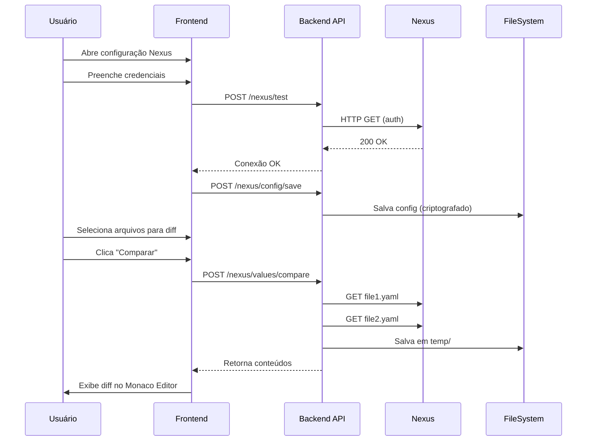

# Plano de Implementação: Diff de Values do Nexus

## 📋 Objetivo
Criar funcionalidade para comparar arquivos YAML de diferentes ambientes/configurações armazenados no Nexus, permitindo visualização lado-a-lado das diferenças.

## 🔍 Análise Técnica

### Nexus Repository Manager API

#### Tipos de Nexus
1. **Nexus 2.x** - API REST legada
2. **Nexus 3.x** - API REST moderna (mais comum atualmente)

#### APIs Disponíveis no Nexus 3.x

**1. Raw Repository API (mais adequado para o caso)**
- Acesso direto aos arquivos via HTTP/HTTPS
- Autenticação: Basic Auth (usuário:senha)
- GET direto na URL do arquivo
- Exemplo: `https://nexus.example.com/repository/workspace/path/to/file.yaml`

**2. REST API v1**
- Endpoints: `/service/rest/v1/*`
- Permite buscar, listar e baixar assets
- Requer autenticação via header `Authorization: Basic <base64(user:pass)>`

**3. Assets API**
- Endpoint: `/service/rest/v1/assets`
- Query params: `repository`, `group`, `name`
- Retorna metadados + URL de download

### URL Pattern Identificado
```
https://nexus.viavarejo.com.br/repository/workspace/<nome-release>/<versão>/<ambiente>/helm-values/<base/prd/hlg>-values.yaml
```

**Parâmetros variáveis:**
- `nome-release`: Nome do release/projeto
- `versão`: Versão semântica (ex: v1.2.3)
- `ambiente`: dev, sit, uat, prd, etc
- `tipo`: base, prd, hlg, sit, dev, etc

## 🏗️ Arquitetura da Solução

### Backend (Go)

#### 1. Estrutura de Configuração
```go
// internal/pkg/nexus/types.go
type NexusConfig struct {
    BaseURL     string `json:"baseUrl"`     // https://nexus.viavarejo.com.br
    Repository  string `json:"repository"`  // workspace
    Username    string `json:"username"`
    Password    string `json:"password"`    // criptografado
    TempDir     string `json:"tempDir"`     // pasta temporária para downloads
}

type ValuesFileRequest struct {
    Release     string `json:"release"`     // nome-release
    Version     string `json:"version"`     // versão
    Environment string `json:"environment"` // ambiente
    Type        string `json:"type"`        // base/prd/hlg/sit
}

type NexusValuesResponse struct {
    Content  string `json:"content"`
    FilePath string `json:"filePath"`
    Size     int64  `json:"size"`
    Error    string `json:"error,omitempty"`
}
```

#### 2. Cliente Nexus
```go
// internal/pkg/nexus/client.go
type Client interface {
    // Testa conexão e autenticação
    TestConnection() error
    
    // Baixa um arquivo de values
    DownloadValues(req ValuesFileRequest) (*NexusValuesResponse, error)
    
    // Baixa múltiplos arquivos para comparação
    DownloadMultipleValues(reqs []ValuesFileRequest) ([]NexusValuesResponse, error)
    
    // Lista versões disponíveis de um release
    ListVersions(release string) ([]string, error)
    
    // Lista ambientes disponíveis em uma versão
    ListEnvironments(release, version string) ([]string, error)
}
```

#### 3. Handlers HTTP
```go
// internal/web/handlers/nexus.go

// POST /api/v1/nexus/test
// Testa conexão com Nexus
func (h *NexusHandler) TestConnection(c *gin.Context)

// POST /api/v1/nexus/values/download
// Baixa um arquivo de values
func (h *NexusHandler) DownloadValues(c *gin.Context)

// POST /api/v1/nexus/values/compare
// Baixa dois arquivos e retorna conteúdo para diff
func (h *NexusHandler) CompareValues(c *gin.Context)

// GET /api/v1/nexus/releases/:release/versions
// Lista versões disponíveis
func (h *NexusHandler) ListVersions(c *gin.Context)

// GET /api/v1/nexus/releases/:release/versions/:version/environments
// Lista ambientes disponíveis
func (h *NexusHandler) ListEnvironments(c *gin.Context)
```

#### 4. Gerenciamento de Configuração
```go
// Persistência da configuração em arquivo
// ~/.k8s-hpa-manager/nexus-config.json (criptografado)

type ConfigManager interface {
    Save(config NexusConfig) error
    Load() (*NexusConfig, error)
    Delete() error
}
```

#### 5. Segurança
- Senha criptografada usando AES-256
- Chave de criptografia derivada de senha mestre ou variável de ambiente
- Arquivo de configuração com permissões restritas (0600)

### Frontend (React/TypeScript)

#### 1. Novos Hooks
```typescript
// hooks/useNexus.ts

// Hook para gerenciar configuração do Nexus
export const useNexusConfig = () => {
  const saveConfig = async (config: NexusConfig) => { ... }
  const loadConfig = async () => { ... }
  const testConnection = async (config: NexusConfig) => { ... }
  return { saveConfig, loadConfig, testConnection }
}

// Hook para operações com values
export const useNexusValues = () => {
  const downloadValues = async (req: ValuesFileRequest) => { ... }
  const compareValues = async (req1: ValuesFileRequest, req2: ValuesFileRequest) => { ... }
  const listVersions = async (release: string) => { ... }
  const listEnvironments = async (release: string, version: string) => { ... }
  return { downloadValues, compareValues, listVersions, listEnvironments }
}
```

#### 2. Componentes Novos

**NexusConfigPanel**
- Modal/Dialog para configuração do Nexus
- Campos:
  - URL Base do Nexus
  - Nome do Repository
  - Usuário
  - Senha (input type="password")
  - Diretório temporário
- Botão "Testar Conexão"
- Botão "Salvar"
- Feedback visual de status

**NexusValuesDiffPanel**
- Interface para selecionar dois arquivos para comparar
- Campos para cada arquivo:
  - Nome do Release (input ou select se listar)
  - Versão (select dinâmico)
  - Ambiente (select dinâmico)
  - Tipo (select: base/prd/hlg/sit/dev)
- Botão "Comparar"
- Área de visualização com Monaco Diff Editor
- Botão "Exportar Diff"

#### 3. Nova Aba no Menu Principal
```typescript
// Adicionar aba "Nexus Values" no menu principal
<Tab value="nexus-values">
  <FileCode className="h-4 w-4" />
  Nexus Values
</Tab>
```

### Fluxo de Uso



## 📂 Estrutura de Arquivos

### Backend
```
internal/
  pkg/
    nexus/
      types.go          # Tipos e structs
      client.go         # Cliente HTTP para Nexus
      config.go         # Gerenciamento de configuração
      crypto.go         # Criptografia de senha
  web/
    handlers/
      nexus.go          # Handlers HTTP
    middleware/
      nexus_auth.go     # Middleware para validar config Nexus
```

### Frontend
```
src/
  components/
    NexusConfigPanel.tsx        # Painel de configuração
    NexusValuesDiffPanel.tsx    # Painel de diff
    NexusFileSelector.tsx       # Seletor de arquivo do Nexus
  hooks/
    useNexus.ts                 # Hooks para Nexus
  store/
    nexusStore.ts               # Estado global Nexus (Zustand)
  types/
    nexus.ts                    # Tipos TypeScript
```

## 🔐 Segurança

### Considerações
1. **Credenciais**
   - Armazenadas criptografadas no backend
   - Nunca expostas no frontend após salvar
   - Transmitidas apenas via HTTPS

2. **Arquivos Temporários**
   - Pasta temporária configurável
   - Cleanup automático após X horas
   - Permissões restritas (0700)

3. **Validação**
   - Validação de URL do Nexus
   - Sanitização de paths
   - Limite de tamanho de arquivo (ex: 10MB)

## 🎯 Fases de Implementação

### Fase 1: Backend - Estrutura Base
- [ ] Criar tipos e structs
- [ ] Implementar cliente HTTP básico
- [ ] Implementar download de arquivo único
- [ ] Testes unitários

### Fase 2: Backend - Configuração e Segurança
- [ ] Implementar criptografia de senha
- [ ] Implementar ConfigManager
- [ ] Implementar handlers HTTP
- [ ] Testes de integração

### Fase 3: Frontend - Configuração
- [ ] Criar store Zustand
- [ ] Implementar hooks básicos
- [ ] Criar NexusConfigPanel
- [ ] Integrar com backend

### Fase 4: Frontend - Diff
- [ ] Criar NexusFileSelector
- [ ] Criar NexusValuesDiffPanel
- [ ] Integrar Monaco Diff Editor
- [ ] Implementar download múltiplo

### Fase 5: Refinamentos
- [ ] Adicionar lista de versões/ambientes
- [ ] Adicionar histórico de comparações
- [ ] Adicionar exportação de diff
- [ ] Melhorar feedback visual
- [ ] Documentação

## 🧪 Testes Necessários

### Backend
1. Cliente Nexus com mock server
2. Criptografia/descriptografia de senha
3. Download de arquivo
4. Comparação de múltiplos arquivos
5. Handlers HTTP

### Frontend
1. Formulário de configuração
2. Teste de conexão
3. Seleção de arquivos
4. Visualização de diff
5. Exportação

## 📝 Configuração Exemplo

```json
{
  "baseUrl": "https://nexus.viavarejo.com.br",
  "repository": "workspace",
  "username": "usuario.nexus",
  "password": "<encrypted>",
  "tempDir": "/tmp/k8s-hpa-nexus"
}
```

## 🔄 APIs do Nexus a Investigar

### Testes Iniciais Recomendados

#### 1. Download Direto (Raw)
```bash
curl -u username:password \
  https://nexus.viavarejo.com.br/repository/workspace/release/v1.0.0/prd/helm-values/base-values.yaml
```

#### 2. API REST
```bash
curl -u username:password \
  https://nexus.viavarejo.com.br/service/rest/v1/assets?repository=workspace
```

#### 3. Buscar Asset Específico
```bash
curl -u username:password \
  "https://nexus.viavarejo.com.br/service/rest/v1/search?repository=workspace&name=base-values.yaml"
```

## ⚠️ Considerações e Riscos

### Riscos Técnicos
1. **Versão do Nexus desconhecida** - Pode ter API diferente
2. **Autenticação específica** - Pode usar LDAP/SSO ao invés de Basic Auth
3. **Estrutura de pastas variável** - Pattern pode variar entre projetos
4. **Rate limiting** - Nexus pode limitar requisições

### Mitigações
1. Implementar detecção de versão do Nexus
2. Suportar múltiplos métodos de auth
3. Permitir template customizável de URL
4. Implementar retry com backoff exponencial

## 🚀 Próximos Passos

1. **Validar acesso ao Nexus**
   - Testar URLs manualmente com curl
   - Confirmar método de autenticação
   - Verificar estrutura real das pastas

2. **Decidir abordagem**
   - Raw download (mais simples)
   - API REST (mais robusto)
   - Híbrido

3. **Prototipar**
   - Cliente Go básico
   - Teste com ambiente real
   - Validar viabilidade

4. **Implementar fases sequencialmente**

---

## 💡 Perguntas para Validação

Antes de prosseguir com a implementação, seria útil responder:

1. ✅ **Qual versão do Nexus está em uso?** (2.x ou 3.x)
2. ✅ **O acesso atual funciona com Basic Auth?** (usuário:senha)
3. ✅ **Existe alguma política de segurança adicional?** (VPN, IP whitelist, etc)
4. ✅ **A estrutura de pastas é sempre consistente?** Ou varia por projeto?
5. ✅ **Quais ambientes são usados?** (dev, sit, uat, hlg, prd, outros?)
6. ✅ **Tipos de values permitidos?** (base, sit, prd, hlg, outros?)
7. ✅ **Tamanho típico dos arquivos?** (para definir limites)

---

**Status:** ✅ **IMPLEMENTAÇÃO COMPLETA - FASE 1 a 4 CONCLUÍDAS**

## 📊 Resumo da Implementação

### ✅ Backend Completo
- [x] Tipos e structs (`internal/pkg/nexus/types.go`)
- [x] Cliente HTTP (`internal/pkg/nexus/client.go`)
- [x] Criptografia AES-256-GCM (`internal/pkg/nexus/crypto.go`)
- [x] ConfigManager com persistência (`internal/pkg/nexus/config.go`)
- [x] Handlers HTTP (`internal/web/handlers/nexus.go`)
- [x] Rotas registradas no servidor (`internal/web/server.go`)
- [x] Compilação bem-sucedida

### ✅ Frontend Completo
- [x] Tipos TypeScript (`src/types/nexus.ts`)
- [x] Hooks React (`src/hooks/useNexus.ts`)
- [x] Painel de configuração (`src/components/NexusConfigPanel.tsx`)
- [x] Painel de comparação (`src/components/NexusValuesDiffPanel.tsx`)
- [x] Integração no menu principal (`src/pages/Index.tsx`)
- [x] Nova aba "Nexus Values" adicionada

### 🎯 Funcionalidades Implementadas

#### Configuração
- ✅ Modal de configuração do Nexus
- ✅ Teste de conexão
- ✅ Armazenamento seguro de credenciais (criptografadas)
- ✅ Validação de campos obrigatórios
- ✅ Remoção de configuração

#### Comparação de Values
- ✅ Seleção de dois arquivos (release, versão, ambiente, tipo)
- ✅ Download paralelo dos arquivos
- ✅ Visualização lado-a-lado com Monaco Diff Editor
- ✅ Exportação do diff
- ✅ Validação de ambientes e tipos
- ✅ Feedback visual de erros

### 📁 Arquivos Criados

**Backend (Go):**
```
internal/pkg/nexus/
  ├── types.go           # Tipos, structs e interfaces
  ├── client.go          # Cliente HTTP para Nexus
  ├── config.go          # Gerenciamento de configuração
  └── crypto.go          # Criptografia de senhas

internal/web/handlers/
  └── nexus.go           # Handlers HTTP

internal/web/server.go   # Rotas registradas
```

**Frontend (React/TypeScript):**
```
src/types/
  └── nexus.ts                        # Tipos TypeScript

src/hooks/
  └── useNexus.ts                     # Hooks React

src/components/
  ├── NexusConfigPanel.tsx            # Painel de configuração
  └── NexusValuesDiffPanel.tsx        # Painel de comparação

src/pages/
  └── Index.tsx                       # Menu principal (modificado)
```

### 🔗 Endpoints da API

| Método | Endpoint | Descrição |
|--------|----------|-----------|
| GET | `/api/v1/nexus/status` | Verifica se Nexus está configurado |
| POST | `/api/v1/nexus/test` | Testa conexão com credenciais |
| GET | `/api/v1/nexus/config` | Carrega configuração salva |
| POST | `/api/v1/nexus/config` | Salva configuração |
| DELETE | `/api/v1/nexus/config` | Remove configuração |
| POST | `/api/v1/nexus/values/download` | Baixa um arquivo de values |
| POST | `/api/v1/nexus/values/compare` | Compara dois arquivos |

### 🔐 Segurança Implementada

1. **Criptografia de Senha**
   - Algoritmo: AES-256-GCM
   - Chave derivada de SHA-256
   - Configurável via variável de ambiente `K8S_HPA_ENCRYPTION_KEY`

2. **Armazenamento**
   - Arquivo: `~/.k8s-hpa-manager/nexus-config.json`
   - Permissões: 0600 (apenas proprietário)
   - Senha sempre criptografada

3. **Transmissão**
   - Autenticação: Basic Auth (HTTPS)
   - Credenciais nunca expostas no frontend após salvamento

### 📝 Como Usar

#### 1. Configurar Nexus
1. Abra a aba "Nexus Values" no menu
2. Clique em "Configurar Nexus"
3. Preencha:
   - URL Base: `https://nexus.viavarejo.com.br`
   - Repository: `workspace`
   - Usuário SSO
   - Senha
   - Diretório temporário (opcional)
4. Clique em "Testar Conexão"
5. Clique em "Salvar"

#### 2. Comparar Arquivos
1. Arquivo 1:
   - Release: nome do release
   - Versão: ex: v1.0.0
   - Ambiente: dev, sit, uat, hlg, prd
   - Tipo: base, sit, prd, hlg, dev

2. Arquivo 2:
   - Preencha da mesma forma

3. Clique em "Comparar"

4. Visualize o diff lado-a-lado

5. (Opcional) Clique em "Exportar" para salvar

### 🧪 Testes Recomendados

#### Backend
```bash
# Compilar
make build

# Executar
./build/new-k8s-hpa web
```

#### Frontend
```bash
# Acessar
http://localhost:8080

# Navegar para aba "Nexus Values"
```

#### Testes Manuais
1. ✅ Configuração sem credenciais (deve mostrar erro)
2. ✅ Teste de conexão com credenciais inválidas
3. ✅ Teste de conexão com credenciais válidas
4. ✅ Salvamento e carregamento de configuração
5. ✅ Comparação de arquivos válidos
6. ✅ Comparação de arquivos inexistentes (deve mostrar erro)
7. ✅ Exportação de diff

---

**Status:** ✅ **IMPLEMENTAÇÃO COMPLETA + DEBUG LOGS - PRONTO PARA TESTE**

## 🔍 Debug e Logs Adicionados

### Logs do Backend
- Log de cada requisição de download
- Log da URL construída
- Log do usuário autenticado
- Log do status HTTP da resposta
- Log do tamanho dos dados baixados
- Logs de erro detalhados

### Logs do Frontend
- Console logs de todas as operações
- Trace completo do fluxo de download
- Logs de erro com contexto
- Informações de debug para troubleshooting

### Ferramentas de Debug
1. **Script de teste de conexão:** [test-nexus-connection.sh](test-nexus-connection.sh)
   - Testa conectividade com Nexus
   - Valida autenticação
   - Lista repositories disponíveis
   - Verifica repository 'workspace'
   - Exemplo de uso da URL

2. **Guia de debug:** [DEBUG_NEXUS.md](DEBUG_NEXUS.md)
   - Instruções detalhadas de teste
   - Troubleshooting de erros comuns
   - Checklist de verificação
   - Exemplos de logs esperados

## 📊 Como Usar

### 1. Testar Conexão Manualmente
```bash
./test-nexus-connection.sh seu_usuario sua_senha
```

### 2. Iniciar Aplicação
```bash
./build/new-k8s-hpa web
```

### 3. Usar a Interface
1. Abrir http://localhost:8080
2. Ir para aba "Nexus Values"
3. Configurar credenciais
4. Testar conexão
5. Comparar arquivos

### 4. Verificar Logs
- **Frontend:** Abrir DevTools (F12) → Console
- **Backend:** Terminal onde está rodando a aplicação

## 📝 Arquivos Criados para Debug

1. `DEBUG_NEXUS.md` - Guia completo de debug e troubleshooting
2. `test-nexus-connection.sh` - Script de teste de conexão
3. Logs adicionados em:
   - `internal/pkg/nexus/client.go`
   - `internal/web/handlers/nexus.go`
   - `internal/web/frontend/src/hooks/useNexus.ts`
   - `internal/web/frontend/src/components/NexusValuesDiffPanel.tsx`

## 🎯 Próximos Passos

1. Execute o script de teste: `./test-nexus-connection.sh usuario senha`
2. Inicie a aplicação: `./build/new-k8s-hpa web`
3. Configure o Nexus na interface
4. Tente fazer um download/comparação
5. Analise os logs para identificar o problema
6. Consulte o DEBUG_NEXUS.md para soluções

---

**Status:** ✅ **IMPLEMENTAÇÃO COMPLETA - AGUARDANDO VALIDAÇÃO**

Após validação das informações acima, podemos prosseguir com a implementação.
