# 💡 Propostas de Features Baseadas em Contexto Real

**Data:** 2025-12-04
**Versão Atual:** v1.3.1
**Próxima Release:** v1.4.0

---

## 🎯 Análise de Contexto de Uso

### Perfil do Usuário
**Você é:** SRE/DevOps/Platform Engineer gerenciando clusters Kubernetes em Azure AKS

**Casos de Uso Principais:**
1. 📈 **Scaling Planejado** - Upscale/Downscale de HPAs e Node Pools para eventos (Black Friday, campanhas)
2. 🔧 **Troubleshooting** - Investigar problemas de performance (CPU, Memory, Replicas)
3. ⚙️ **Configuração** - Ajustar ConfigMaps, Secrets, CronJobs
4. 📊 **Monitoramento** - Acompanhar métricas e alertas Prometheus
5. 🚨 **Incidentes** - Responder rapidamente a alertas críticos
6. 📝 **Auditoria** - Rastrear mudanças e ter histórico de operações

### Workflow Típico Observado

```mermaid
graph TD
    A[Alerta Crítico] --> B[Investigar Métricas]
    B --> C{Causa Identificada?}
    C -->|CPU Alto| D[Ajustar HPA Targets]
    C -->|Memória| E[Ajustar Resources]
    C -->|Node Pressure| F[Escalar Node Pools]
    D --> G[Aplicar Mudanças]
    E --> G
    F --> G
    G --> H[Monitorar Resultado]
    H --> I{Resolvido?}
    I -->|Não| B
    I -->|Sim| J[Documentar no History]
```



---

## 🚀 Propostas de Features (Priorizadas)

### 🥇 Prioridade ALTA (Quick Wins - Valor Alto + Esforço Baixo)

---

#### 1. 📊 **Dashboard de Capacidade por Namespace**

**Problema que resolve:**
- Atualmente só vê capacidade total do cluster
- Difícil identificar qual namespace está consumindo mais recursos
- Sem visibilidade de "quem está usando o quê"

**Proposta:**
```
Dashboard
  └─ Card "Top Namespaces por Recurso"
      ├─ Top 5 CPU (mCores)
      ├─ Top 5 Memory (GB)
      ├─ Top 5 Pods (count)
      └─ Drill-down para detalhes do namespace
```

**Valor de Negócio:**
- ✅ Identifica "culpados" de consumo excessivo
- ✅ Facilita planejamento de capacidade
- ✅ Ajuda em chargeback/showback

**Esforço:** 🟢 Baixo (2-3 dias)
- Backend: Endpoint `/api/v1/namespaces/:cluster/top` usando Prometheus queries
- Frontend: Componente `TopNamespacesCard` com drill-down

**API Backend:**
```go
// GET /api/v1/namespaces/:cluster/top?metric=cpu|memory|pods&limit=5
type NamespaceUsage struct {
    Namespace string  `json:"namespace"`
    Value     float64 `json:"value"`
    Unit      string  `json:"unit"`
    Percentage float64 `json:"percentage"` // % do total do cluster
}
```

---

#### 2. 🔍 **Search Global (Cmd+K)**

**Problema que resolve:**
- Muitas funcionalidades espalhadas em diferentes abas
- Usuário precisa lembrar "onde" está cada coisa
- Navegação lenta (cliques manuais)

**Proposta:**
```
Cmd+K / Ctrl+K abre modal de busca:

┌─────────────────────────────────────────┐
│  🔍 Buscar...                          │
├─────────────────────────────────────────┤
│  Resultados:                            │
│                                         │
│  📊 HPAs (3)                            │
│    → payment-api-hpa (prod)            │
│    → checkout-hpa (prod)               │
│    → cart-service-hpa (staging)        │
│                                         │
│  🚀 Deployments (2)                     │
│    → nginx-ingress (kube-system)       │
│    → payment-api (prod)                │
│                                         │
│  ⚙️  ConfigMaps (1)                     │
│    → app-config (prod)                 │
│                                         │
│  🔗 Ações Rápidas                      │
│    → Ir para Dashboard                 │
│    → Ir para Staging                   │
│    → Abrir History Viewer              │
└─────────────────────────────────────────┘
```

**Features:**
- Busca por nome de recurso (HPA, Pod, Deployment, ConfigMap, Secret)
- Busca por namespace
- Ações rápidas (ir para aba X, aplicar sessão Y)
- Histórico de buscas recentes
- Keyboard navigation (↑↓ Enter)

**Valor de Negócio:**
- ✅ Navegação 10x mais rápida
- ✅ Reduz curva de aprendizado
- ✅ Aumenta produtividade

**Esforço:** 🟢 Baixo (2-3 dias)
- Frontend: Componente `<CommandPalette>` usando `cmdk` (Paywel Command)
- Backend: Endpoint `/api/v1/search?q=termo&types=hpa,pod,deployment`

---

#### 3. 📋 **Quick Actions no Header**

**Problema que resolve:**
- Ações comuns exigem muitos cliques
- Sem atalhos visuais para operações frequentes

**Proposta:**
```
Header (ao lado do Cluster Selector):

[🔍 Search] [📊 Quick Stats] [🔔 Alertas (3)] [⚡ Actions ▼]
                                                   │
                                                   ├─ 🚨 Ver Alertas Críticos
                                                   ├─ 📈 Abrir Monitoramento
                                                   ├─ 📦 Ver Staging (badge: 2)
                                                   ├─ 💾 Save Session
                                                   ├─ 📜 Ver History
                                                   ├─ 🔄 Reload Current View
                                                   └─ ⚙️  Configurações
```

**Valor de Negócio:**
- ✅ Ações comuns acessíveis em 1 clique
- ✅ Badge de notificações visível sempre
- ✅ Melhora discoverability de features

**Esforço:** 🟢 Muito Baixo (1 dia)
- Frontend: Componente `<QuickActionsMenu>` com dropdown

---

#### 4. 🔗 **Links Diretos para Recursos Externos**

**Problema que resolve:**
- Usuário precisa navegar manualmente para Grafana, Kibana, Azure Portal
- Sem contexto preservado (cluster, namespace, resource)

**Proposta:**
```
Em cada HPA/Pod/Deployment/NodePool, adicionar ícones de "Quick Links":

┌────────────────────────────────────────────┐
│  payment-api-hpa (prod)                   │
│                                            │
│  Min: 3 → Max: 10                         │
│  CPU Target: 70%                          │
│                                            │
│  [⚙️ Edit] [📊 Monitor] [🔗 Links ▼]      │
│                            │              │
│                            ├─ 📈 Grafana Dashboard
│                            ├─ 📜 Kibana Logs
│                            ├─ 🌐 Azure Portal (Node Pool)
│                            ├─ 🎯 Prometheus Metrics
│                            └─ 📘 K8s Dashboard
└────────────────────────────────────────────┘
```

**Configuração:**
```typescript
// .env ou config
GRAFANA_URL=https://grafana.company.com/d/{dashboard}?var-namespace={namespace}&var-pod={pod}
KIBANA_URL=https://kibana.company.com/app/discover#/?_a=(query:(match_phrase:(namespace:{namespace})))
AZURE_PORTAL_URL=https://portal.azure.com/#@{tenant}/resource/{resourceId}
```

**Valor de Negócio:**
- ✅ Navegação contextual entre ferramentas
- ✅ Reduz tempo de troubleshooting
- ✅ Preserva contexto (cluster, namespace, resource)

**Esforço:** 🟡 Médio (3-4 dias)
- Backend: Endpoint `/api/v1/config/links` para retornar URLs configuradas
- Frontend: Componente `<ExternalLinksDropdown>` com template engine

---

### 🥈 Prioridade MÉDIA (Valor Alto + Esforço Médio)

---

#### 5. 📊 **Comparação de Métricas Antes/Depois de Mudanças**

**Problema que resolve:**
- Após aplicar mudanças, não tem visualização clara do impacto
- Difícil validar se scaling resolveu o problema

**Proposta:**
```
Após aplicar mudanças no Staging:

┌──────────────────────────────────────────────────┐
│  Impacto das Mudanças                           │
├──────────────────────────────────────────────────┤
│                                                  │
│  📊 payment-api-hpa                             │
│                                                  │
│  ┌─────────────┬─────────────┬─────────────┐   │
│  │   ANTES     │   DEPOIS    │   DELTA     │   │
│  ├─────────────┼─────────────┼─────────────┤   │
│  │ Min: 3      │ Min: 5      │ +2 (+66%)  │   │
│  │ Max: 10     │ Max: 15     │ +5 (+50%)  │   │
│  │ CPU: 80%    │ CPU: 70%    │ -10% ⬇️     │   │
│  │                                          │   │
│  │ Réplicas Atuais: 8                      │   │
│  │ Após Apply: ~10 (estimativa)            │   │
│  └──────────────────────────────────────────┘   │
│                                                  │
│  [📈 Ver Gráfico Comparativo]                  │
│  [✅ Confirmar Apply]  [❌ Cancelar]            │
└──────────────────────────────────────────────────┘
```

**Features:**
- Diff visual dos valores (antes/depois)
- Estimativa de impacto (cálculo de réplicas esperadas)
- Gráfico de comparação pós-apply (T-30min vs T+30min)

**Valor de Negócio:**
- ✅ Validação visual do impacto
- ✅ Facilita decisão de aprovar mudança
- ✅ Documentação automática de impacto

**Esforço:** 🟡 Médio (4-5 dias)
- Backend: Cálculo de estimativas baseado em métricas atuais
- Frontend: Componente `<ChangeImpactViewer>` com gráficos

---

#### 6. 🚨 **Alertas Contextuais com Ações Sugeridas**

**Problema que resolve:**
- Alertas mostram apenas o problema, não a solução
- Usuário precisa descobrir "o que fazer" sozinho

**Proposta:**
```
Alert: "payment-api-hpa CPU > 80% por 5 minutos"

┌──────────────────────────────────────────────────┐
│  🚨 Alerta Crítico                              │
├──────────────────────────────────────────────────┤
│                                                  │
│  payment-api-hpa (prod)                         │
│  CPU: 85% (Target: 70%)                         │
│  Duração: 12 minutos                            │
│                                                  │
│  🤖 Ações Sugeridas:                            │
│                                                  │
│  1. ⚡ Quick Fix (1 clique)                     │
│     └─ Reduzir CPU Target para 60%             │
│        (permite mais réplicas)                  │
│                                                  │
│  2. 🔧 Ajuste Manual                            │
│     └─ Aumentar Max Replicas de 10 para 15    │
│                                                  │
│  3. 📈 Investigar Causa Raiz                    │
│     └─ Ver métricas detalhadas                 │
│     └─ Logs de erro no Kibana                  │
│                                                  │
│  [⚡ Aplicar Quick Fix]  [🔧 Editar HPA]        │
└──────────────────────────────────────────────────┘
```

**Lógica de Sugestões:**
```typescript
// Engine de recomendações
if (cpuUsage > target) {
  suggestions.push({
    action: "reduce_target",
    description: "Reduzir CPU Target para {target-10}%",
    impact: "Permite HPA escalar mais cedo",
    confidence: "high"
  });

  if (currentReplicas >= maxReplicas * 0.9) {
    suggestions.push({
      action: "increase_max",
      description: "Aumentar Max Replicas",
      impact: "Mais réplicas disponíveis para escalar",
      confidence: "medium"
    });
  }
}
```

**Valor de Negócio:**
- ✅ Reduz MTTR (Mean Time To Resolution)
- ✅ Onboarding mais fácil (júniores conseguem resolver)
- ✅ Documentação de best practices embutida

**Esforço:** 🟡 Médio (5-6 dias)
- Backend: Engine de recomendações (`internal/recommendations/engine.go`)
- Frontend: Componente `<AlertActionsDialog>` com quick actions

---

#### 7. 📊 **Cost Estimator (Custo de Mudanças)**

**Problema que resolve:**
- Não tem visibilidade do impacto financeiro de mudanças
- Aprovações de upscale precisam de justificativa de custo

**Proposta:**
```
Antes de aplicar mudanças no Staging:

┌──────────────────────────────────────────────────┐
│  💰 Estimativa de Custo                         │
├──────────────────────────────────────────────────┤
│                                                  │
│  Mudanças no payment-api-hpa:                   │
│  • Min Replicas: 3 → 5 (+2)                     │
│  • Max Replicas: 10 → 15 (+5)                   │
│                                                  │
│  Resource Specs:                                │
│  • CPU Request: 500m x 2 replicas = 1000m      │
│  • Memory Request: 512Mi x 2 replicas = 1GB    │
│                                                  │
│  ┌─────────────────────────────────────────┐   │
│  │  Custo Mensal Estimado                 │   │
│  ├─────────────────────────────────────────┤   │
│  │  Antes:  R$ 450/mês (3-10 replicas)    │   │
│  │  Depois: R$ 675/mês (5-15 replicas)    │   │
│  │                                          │   │
│  │  Delta:  +R$ 225/mês (+50%)             │   │
│  │          +R$ 2.700/ano                  │   │
│  └─────────────────────────────────────────┘   │
│                                                  │
│  [💰 Ver Breakdown Detalhado]                  │
│  [✅ Confirmar Apply]  [❌ Cancelar]            │
└──────────────────────────────────────────────────┘
```

**Configuração de Preços:**
```typescript
// .env ou config
AZURE_PRICING_CPU_VCPU_PER_HOUR=0.038  // USD
AZURE_PRICING_MEMORY_GB_PER_HOUR=0.004
EXCHANGE_RATE_USD_TO_BRL=5.0
```

**Valor de Negócio:**
- ✅ Justificativa de custo para aprovações
- ✅ Evita surpresas na fatura Azure
- ✅ Facilita planejamento de budget

**Esforço:** 🟡 Médio (3-4 dias)
- Backend: Calculadora de custo baseada em resource requests
- Frontend: Componente `<CostEstimator>` com breakdown

---

### 🥉 Prioridade BAIXA (Valor Médio + Esforço Alto)

---

#### 8. 🤖 **Autopilot Mode (AI-Assisted Scaling)**

**Problema que resolve:**
- Scaling manual baseado em observação
- Requer experiência para tomar decisões corretas

**Proposta:**
```
┌──────────────────────────────────────────────────┐
│  🤖 Autopilot Mode (BETA)                       │
├──────────────────────────────────────────────────┤
│                                                  │
│  [ ] Habilitar Autopilot para payment-api-hpa  │
│                                                  │
│  Modo: [Observação ▼] [Sugestão] [Automático] │
│                                                  │
│  Políticas:                                      │
│  ✅ Escalar automaticamente se CPU > 85% por 5min│
│  ✅ Reduzir se CPU < 30% por 30min              │
│  ✅ Manter reserva de 20% de capacidade         │
│  ❌ Escalar após 22h (horário de menor uso)    │
│                                                  │
│  Histórico de Ações:                            │
│  • 02/12 14:30 - Aumentou Max de 10 para 12    │
│  • 01/12 09:15 - Reduziu CPU Target para 65%   │
│                                                  │
│  [⚙️ Configurar Políticas]  [📊 Ver Histórico]  │
└──────────────────────────────────────────────────┘
```

**Modos:**
1. **Observação** - IA analisa mas não age (apenas sugere)
2. **Sugestão** - IA sugere e aguarda aprovação humana
3. **Automático** - IA age sozinha dentro de limites configurados

**Valor de Negócio:**
- ✅ Scaling proativo (antes do problema)
- ✅ Reduz carga operacional
- ✅ Aprende com padrões históricos

**Esforço:** 🔴 Alto (15-20 dias)
- Backend: ML model para predição (ARIMA ou Prophet)
- Backend: Policy engine para aplicar ações
- Frontend: Dashboard de autopilot

**Nota:** Requer dados históricos suficientes (3+ meses)

---

#### 9. 📊 **Multi-Cluster Dashboard Consolidado**

**Problema que resolve:**
- Precisa trocar de cluster para ver métricas
- Sem visão consolidada de múltiplos clusters

**Proposta:**
```
Dashboard Multi-Cluster:

┌──────────────────────────────────────────────────┐
│  Visão Consolidada (3 clusters)                 │
├──────────────────────────────────────────────────┤
│                                                  │
│  ┌──────────┬──────────┬──────────┬──────────┐ │
│  │ CLUSTER  │   CPU    │  MEMORY  │  ALERTS  │ │
│  ├──────────┼──────────┼──────────┼──────────┤ │
│  │ prod     │ 65% 🟢   │ 72% 🟡   │ 3 🔴     │ │
│  │ staging  │ 45% 🟢   │ 55% 🟢   │ 0 🟢     │ │
│  │ dev      │ 30% 🟢   │ 40% 🟢   │ 1 🟡     │ │
│  └──────────┴──────────┴──────────┴──────────┘ │
│                                                  │
│  Top HPAs (todos os clusters):                  │
│  1. payment-api-hpa (prod) - CPU 85%           │
│  2. checkout-hpa (prod) - CPU 78%              │
│  3. cart-service-hpa (staging) - Memory 82%    │
│                                                  │
│  [📊 Ver Detalhes por Cluster]                 │
└──────────────────────────────────────────────────┘
```

**Valor de Negócio:**
- ✅ Visão holística da infraestrutura
- ✅ Identifica problemas cross-cluster
- ✅ Facilita comparação entre ambientes

**Esforço:** 🔴 Alto (10-12 dias)
- Backend: Agregação de métricas de múltiplos clusters
- Frontend: Dashboard consolidado com drill-down

---

### 🎁 Bonus: Quick Wins Adicionais

---

#### 10. 🎨 **Temas Personalizados**

- Dark mode atual + Light mode + High Contrast
- Customização de cores (branding)
- **Esforço:** 🟢 Muito Baixo (1 dia)

#### 11. 📤 **Export para Excel/CSV**

- Export de listas (HPAs, Node Pools, ConfigMaps)
- Útil para relatórios gerenciais
- **Esforço:** 🟢 Baixo (2 dias)

#### 12. 🔔 **Notificações Push (Browser)**

- Notificações de alertas críticos mesmo com aba fechada
- Usa Browser Notification API
- **Esforço:** 🟢 Baixo (2 dias)

#### 13. 📋 **Templates de Sessões**

- Criar templates reutilizáveis (ex: "Upscale Black Friday")
- Aplicar template com 1 clique
- **Esforço:** 🟢 Baixo (2-3 dias)

#### 14. 🔄 **Auto-refresh Configurável**

- Permitir escolher intervalo de refresh (5s, 10s, 30s, 1min)
- Pausar auto-refresh quando inativo
- **Esforço:** 🟢 Muito Baixo (1 dia)

---

## 🎯 Recomendação de Roadmap

### v1.4.0 (Dezembro 2025) - **Sidebar + Quick Wins**
- ✅ Sidebar com 7 grupos
- ✅ Dashboard de Capacidade por Namespace
- ✅ Search Global (Cmd+K)
- ✅ Quick Actions no Header
- ✅ Tab "Pods" (novo)

### v1.5.0 (Janeiro 2026) - **Produtividade**
- ✅ Links Diretos para Recursos Externos
- ✅ Comparação Antes/Depois de Mudanças
- ✅ Notificações Push (Browser)
- ✅ Export Excel/CSV
- ✅ Temas Personalizados

### v1.6.0 (Fevereiro 2026) - **Intelligence**
- ✅ Alertas Contextuais com Ações Sugeridas
- ✅ Cost Estimator
- ✅ Templates de Sessões

### v2.0.0 (Março-Abril 2026) - **Advanced Features**
- ✅ Autopilot Mode (AI-Assisted Scaling)
- ✅ Multi-Cluster Dashboard Consolidado

---

## 💬 Perguntas para Validação

1. **Quais dessas features resolvem seus problemas mais críticos hoje?**
2. **Existe alguma funcionalidade que você usa em outras ferramentas e sente falta aqui?**
3. **Quais operações você faz manualmente hoje que poderiam ser automatizadas?**
4. **Você prefere features que economizam tempo ou features que reduzem erros?**
5. **Tem alguma integração externa que seria valiosa? (Slack, Teams, PagerDuty, etc.)**

---

**Feedback é essencial para priorizar corretamente! 🙏**
